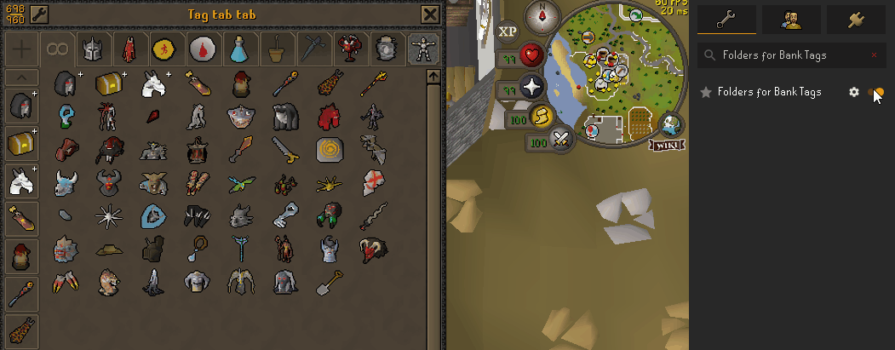
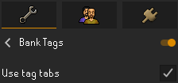
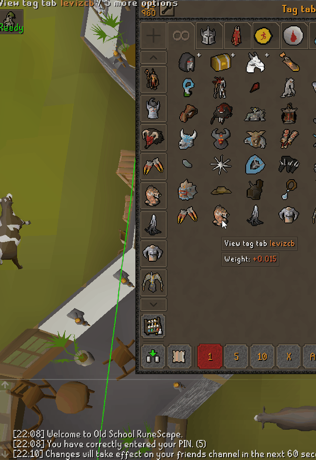
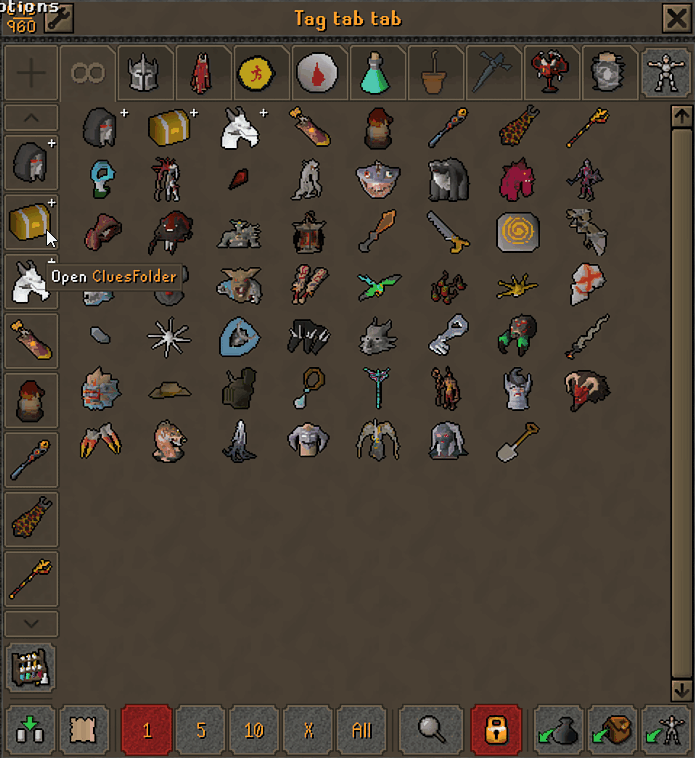
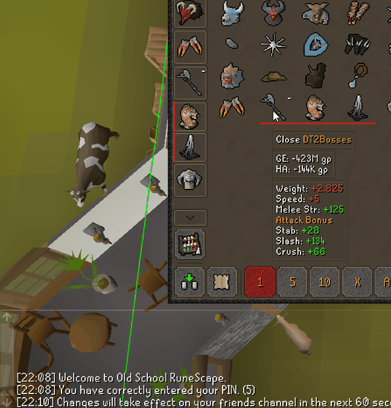

## Folders for Bank Tags

This plugin allows you to create folders for **Bank Tag Tabs**.  
Requires Plugin **Bank Tags** to be enabled with option **Use tag tabs** enabled.  
This plugin does not modify the Bank Tags config in any way, so therefore can safely be enabled or disabled at any time without affecting the underlying Bank Tag Tabs.  

## How to Use
### Creating Folders
Right-click a tab, **Add to folder** -> Choose an existing folder or make a new one.  
Optionally, set a custom icon for the folder.  
Add a tab to a folder by dragging the tab onto the folder icon.  

Left click a folder to expand its contents.  

### Deleting Folders
Right click a folder, **Delete folder**
All of the folder contents will spill out of the folder into the position where the folder was

## License and Credits

This plugin was built from the [Bank Tag Folders](https://github.com/kingkj52/bank-tag-folders)
plugin by KingKj52 and is a derivative of it. That plugin is BSD 2-Clause and so
is this one, and KingKj52's copyright notice is kept in `LICENSE`.

It was written with AI assistance.

BSD 2-Clause. See `LICENSE` and `NOTICE`.
