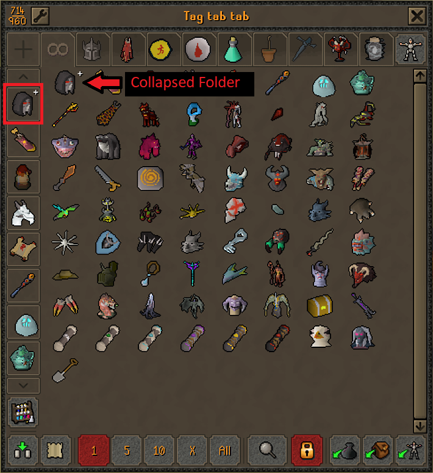
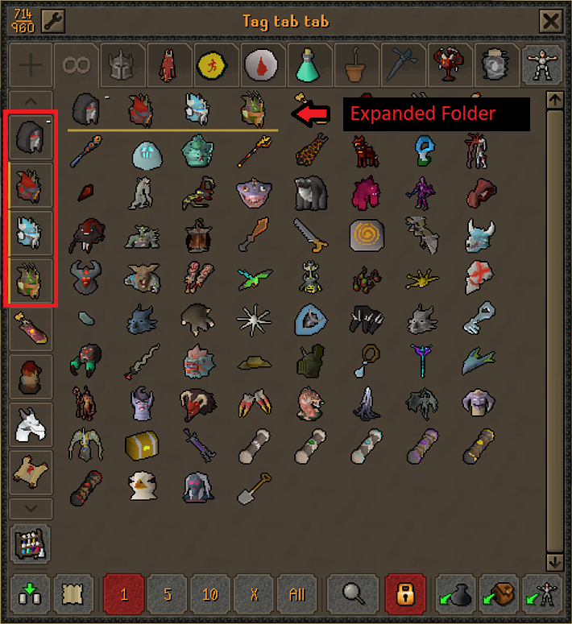

# Folders for Bank Tags

An add-on to the **Bank Tags** plugin

Collapsible folders for the bank tag tab column.

If you keep more tag tabs than fit down the side of the bank, this groups them.
Right-click a tab to put it in a folder, then close the folder to get it out of
the way.

## Using it

| Gesture | Result |
| --- | --- |
| Right-click a tab, **Add to folder** | Choose an existing folder or make a new one |
| Right-click a tab in a folder, **Remove from folder** | Puts it back at the top level |
| Left-click a folder | Opens or closes it |
| Right-click a folder | Rename, Change icon, Delete folder |
| Drag a tab onto a folder | Files it into that folder and opens it |
| Drag a folder onto a tab or another folder | Moves the whole folder there |

## Licence and credits

This plugin was built from the [Bank Tag Folders](https://github.com/kingkj52/bank-tag-folders)
plugin by KingKj52 and is a derivative of it. That plugin is BSD 2-Clause and so
is this one, and KingKj52's copyright notice is kept in `LICENSE`.

It was written with AI assistance.

BSD 2-Clause. See `LICENSE` and `NOTICE`.
